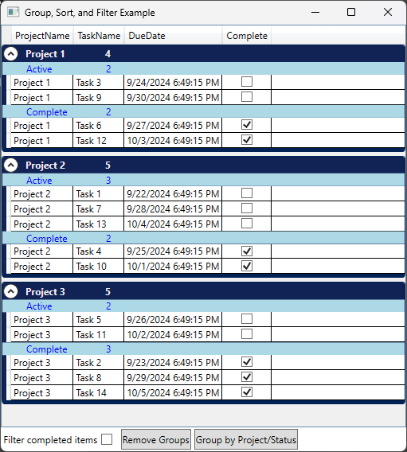

# Group, sort, and filter data in a DataGrid control (WFP, MVVM)

This repository features the example from
[How to: Group, Sort, and Filter Data in the DataGrid Control](https://learn.microsoft.com/en-us/dotnet/desktop/wpf/controls/how-to-group-sort-and-filter-data-in-the-datagrid-control),
enhanced with the CommunityToolkit.Mvvm library.

